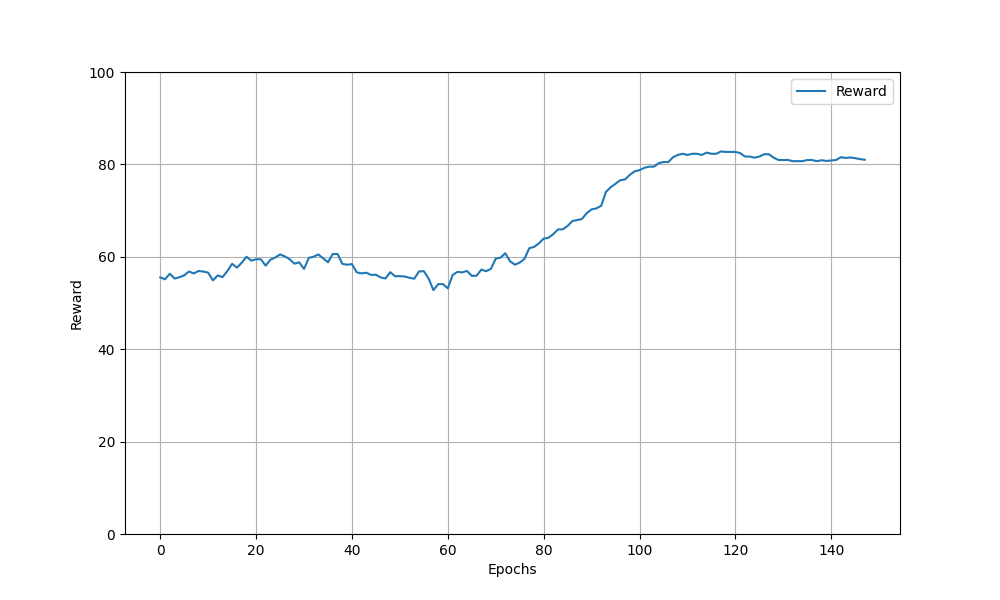

# Rainbow DDPG with ResNet18 Backbone

This repository contains a modified version of the Rainbow DDPG algorithm from the paper "Sim-to-Real Reinforcement Learning for Deformable Object Manipulation". In this version, the backbone of actor has been changed to ResNet18. 

## Instructions

The code was tested on Ubuntu20.04 with Python3.7. Use of virtualenvs is recommended. In the modified code, ResNet has been set to the default actor backbone. To run the training of the modified model:

```
pip install -r requirements.txt
python main.py
```
To run the training of the original model:

```
python main.py --conv-size small
```

## Modifications
The main modifications to the original code are in the `rainbow_ddpg\models.py` file, specifically lines 181 to 212.

## Results

- Original model: According to the authors, running a full training (250 epochs) may take more than 24 hours on a machine with Nvidia Titan GPU and use a considerable amount of memory. The policy ends up with a success rate of around 80%.
- Replacing the actor backbone with ResNet18: It takes more than 4 days for running 150 epochs on a machine with RTX 3090. The policy still ends up with a success rate of around 80% . See the figure below.

Therefore, this modification does not bring any improvement in terms of policy performance compared to the original version. 




## References

For a complete list of references, please see the accompanying paper.

The learning algorithm is based on OpenAI baselines (https://github.com/openai/baselines), the perlin noise file is heavily based on https://github.com/nikagra/python-noise/blob/master/noise.py and robot meshes are generated from https://github.com/Kinovarobotics/kinova-ros. 
